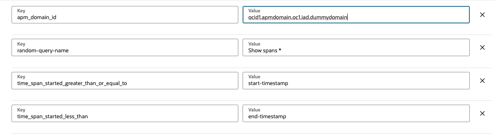

# OCI APM data exporter function setup

This is a OCI (Oracle Cloud Infrastructure) APM data exporter function setup which will create an OCI function wrapped within an API gateway that can then be queried to get APM data in an easy to use format, the function code is also available if the default format does not fit your needs. 

This project helps with provisioning of all necessary OCI resources, including image creation, the OCI functions application and function, the API Gateway, and associated policies — all implemented using Terraform.

In this example we will be creating:

* 1 x Container registry to store the image (apm-data-exporter-repository/apm-data-exporter)
* 1 x Virtual Cloud Network (VCN) (apm-data-exporter-vcn)
* 1 x Subnet (Public) (public)
* 1 x Internet Gateway for Public Subnet (igw)
* 1 x OCI application (apm-data-exporter-app)
* 1 x OCI function (apm-data-exporter)
* 1 x API Gateway (apm-data-exporter-gateway)
* 1 x API Gateway deployment for the function (apm-data-exporter-gateway-deployment)
* Create and push the function's image to the registry
* Create Functions and gateway Policies.

## Prerequisites

Before you deploy this function for use, make sure you have run step C - 3 of the [Oracle Functions Quick Start Guide for Cloud Shell](https://www.oracle.com/webfolder/technetwork/tutorials/infographics/oci_functions_cloudshell_quickview/functions_quickview_top/functions_quickview/index.html), the auth token is required to push the image to the repository.

    C - 3. Generate auth token

## Terraform Deployment

# Deploy to OCI with one click

Cick on button bellow to deploy the function to OCI using the resource manager, some values will be prepopulated:

[](https://cloud.oracle.com/resourcemanager/stacks/create?zipUrl=https://github.com/M-Iliass/oci-observability-and-management/releases/download/v1.0.0/oci-apm-export-data-release.zip) 

# Deploy using local dev environment:

## Preparation:

Prepare one variable file named `terraform.tfvars` with the required information.

The contents of `terraform.tfvars` should look something like the following:

```
tenancy_ocid = "ocid1.tenancy.oc1..xxxxxxxxxxxxxxxxxxxxxxxxxxxxxxxxxxxxxxxxxxxxxxxxxxxxxxxxxxxx"
compartment_ocid = "ocid1.compartment.oc1..xxxxxxxxxxxxxxxxxxxxxxxxxxxxxxxxxxxxxxxxxxxxxxxxxxxxxxxxxxxx"
region = "us-ashburn-1"
current_user_ocid = "ocid1.user.oc1..xxxxxxxxxxxxxxxxxxxxxxxxxxxxxxxxxxxxxxxxxxxxxxxxxxxxxxxxxxxx"
user_auth_token = "xxxxxxxxxxxxxxx" # Replace with your own auth token
apm_domain_id = ""
```

## Deploying the function:

Apply the changes using the following commands:

```
  terraform init
  terraform plan
  terraform apply
```

## Output

```
Outputs:

URL_to_call = "url/v1/query?query_result_name="
```

You can then call the link above while adding the background query name to the end, and that should return the query result in an easy to use format

### Path Parameters

You can use any of the following parameters to get the desired result:

- **`query_result_name`**:  
  The name of the background query result to use.

  *Example:*  
  ```plaintext
  https://url/v1/query?query_result_name=<background-query-to-run>
  ```

- **`query_tql`**:  
  A URL-encoded string that, when decoded, contains the TQL query to be used.  
  **Note:** When using this parameter, you must also provide the following timestamps in epoch milliseconds (if not specified, the default value is `0`):  
  - `time_span_started_less_than`  
  - `time_span_started_greater_than_or_equal_to`  
  
  *Example:*  
  ```plaintext
  https://url/v1/query?query_tql=<query-to-run>&time_span_started_greater_than_or_equal_to=<start-timestamp>&time_span_started_less_than=<end-timestamp>
  ```

- **`configuration_name`**:  
  The name of the function configuration that holds the TQL query to be used.  
  **Note:** When using this parameter, you must also provide the following timestamps in epoch milliseconds as function configurations: (If not specified, the default value is 0) 
  - `time_span_started_less_than`  
  - `time_span_started_greater_than_or_equal_to`  

  *Example:*  
  ```plaintext
  https://url/v1/query?configuration_name=random-query-name
  ```
  On the OCI console:
  