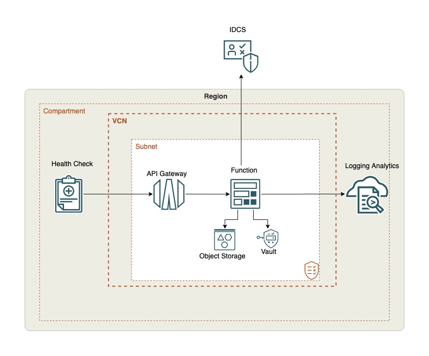

# idcs-auditlog-collector
Oracle Identity Cloud Service (IDCS)  is designed to extend enterprise controls by automating PaaS and SaaS account provisioning and deprovisioning, simplifying the user experience for accessing cloud applications by providing seamless integration with enterprise identity stores and authentication services, and facilitating compliance activities by clearly reporting on cloud application usage. It touches almost all the systems in the IT environment so it is important to monitor it continuously to ensure its secure and identify any vulnerabilities proactively.

Oracle Functions is a serverless, highly scalable, fully managed Functions-as-a-Service platform built on Oracle Cloud Infrastructure and powered by the open-source Fn Project engine. Developers can use Oracle Functions to write and deploy code that delivers business value without worrying about provisioning or managing the underlying infrastructure. Oracle Functions is container-native, with functions packaged as Docker container images.

This Reference Architecture describes Logging Analytics based solution for collecting, processing, enriching and analyzing Oracle IDCS Audit Logs for continuous monitoring and troubleshooting. An OCI Function pulls logs from IDCS REST API Endpoints regularly and ingest them in Logging Analytics for monitoring with IDCS Audit Analysis Dashboard.

## Prerequisites

- Prepare IDCS API to be called with client id/secret by creating a custom application in IDCS and generating client id/secret. Note down IDCS url, client id, and secret.

- Permission to `manage` the following types of resources in your Oracle Cloud Infrastructure tenancy: `vcns`, `internet-gateways`, `route-tables`, `security-lists`, `subnets`, `functionss`, `API Gateways`, and `Health Checks`.

- Quota to create the following resources: 1 VCN, 1 subnets, 1 Internet Gateway, 1 route rules, 1 function, 1 dynamic group, 1 policy, 1 API Gateway, and 1 health check.

If you don't have the required permissions and quota, contact your tenancy administrator. See [Policy Reference](https://docs.cloud.oracle.com/en-us/iaas/Content/Identity/Reference/policyreference.htm), [Service Limits](https://docs.cloud.oracle.com/en-us/iaas/Content/General/Concepts/servicelimits.htm), [Compartment Quotas](https://docs.cloud.oracle.com/iaas/Content/General/Concepts/resourcequotas.htm).

## Deploy Using Oracle Resource Manager

1. Click [](https://cloud.oracle.com/resourcemanager/stacks/create?region=home&zipUrl=https://github.com/oracle-quickstart/oci-observability-and-management/releases/oci-idcs-auditlog-monitoring-latest.zip)

#    If you aren't already signed in, when prompted, enter the tenancy and user credentials.

2. Review and accept the terms and conditions.

3. Select the region where you want to deploy the stack.

4. Follow the on-screen prompts and instructions to create the stack.

5. After creating the stack, click **Terraform Actions**, and select **Plan**.

6. Wait for the job to be completed, and review the plan.

    To make any changes, return to the Stack Details page, click **Edit Stack**, and make the required changes. Then, run the **Plan** action again.

7. If no further changes are necessary, return to the Stack Details page, click **Terraform Actions**, and select **Apply**.

## Deploy Using the Terraform CLI

### Clone the Module
Now, you'll want a local copy of this repo. You can make that with the commands:

    git clone https://github.com/oracle-quickstart/oci-observability-and-management.git
    cd oci-observability-and-management/oci-idcs-monitoring
    ls

### Prerequisites
First off, you'll need to do some pre-deploy setup for Docker and Fn Project inside your machine:

```
sudo su -
yum update
yum install yum-utils
yum-config-manager --enable *addons
yum install docker-engine
groupadd docker
service docker restart
usermod -a -G docker opc
chmod 666 /var/run/docker.sock
exit
curl -LSs https://raw.githubusercontent.com/fnproject/cli/master/install | sh
exit
```
  
### Set Up and Configure Terraform

1. Complete the prerequisites described [here](https://github.com/cloud-partners/oci-prerequisites).

2. Create a `terraform.tfvars` file, and specify the following variables:

```
# Authentication
tenancy_ocid         = "<tenancy_ocid>"
user_ocid            = "<user_ocid>"
fingerprint          = "<finger_print>"
private_key_path     = "<pem_private_key_path>"

# Region
region = "<oci_region>"

# Compartment
compartment_ocid = "<compartment_ocid>"

# IDCS info
idcs_url = "<IDCS_URL>"
idcs_clientid = "<IDCS_CLIENTID>"
idcs_client_vaultsecret = "<VAULT_SECRET-OCID>"

# Logging Analytics info
logging_analytics_group_id = "<logging_analytics_group_ocid>"
# New entity will be created 
log_analytics_entity_name = "<IDCS entity name>"

# OCIR
ocir_user_name         = "<ocir_user_name>"
ocir_user_password     = "<ocir_user_password>"

#

### Create the Resources
Run the following commands:

    terraform init
    terraform plan
    terraform apply

### Test the stack 

You can test the stack by login/logout in the IDCS that generates audit log. The function will load the logs in 5 minutes and you can see it in Log Analytics Log Explorer.

```
Outputs:


### Destroy the Deployment
When you no longer need the deployment, you can run this command to destroy the resources:

    terraform destroy

If there is error in destroying the object storage bucket, manually delete the bucket and run "terraform destroy" again.

### Architecture Diagram

